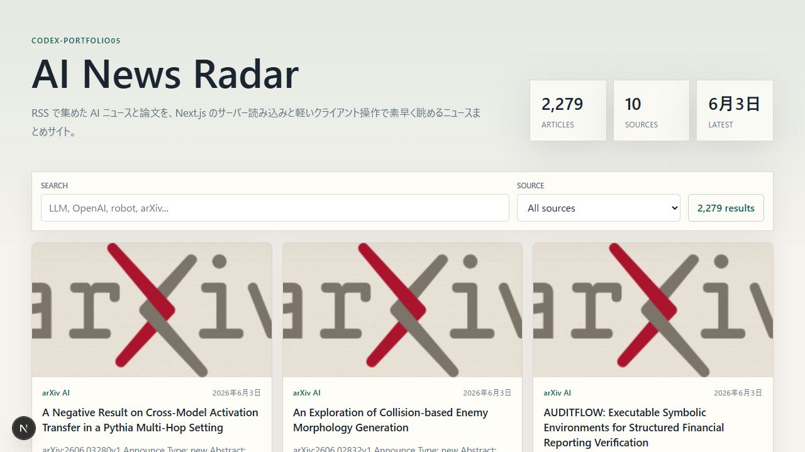
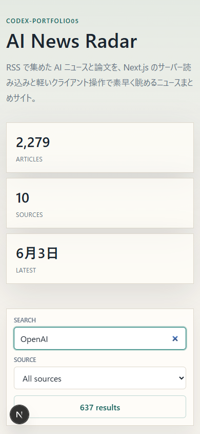
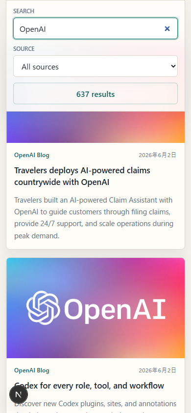

# codex-portfolio05: AI News Radar

`codex-portfolio04` と同じ「AI ニュースを集めて一覧する」目的を、Next.js で現代的に最短実装したポートフォリオです。

04 は Astro と静的 JSON 更新で、当時の実装を保存する作品でした。05 は Next.js App Router を使い、サーバー側で `articles.json` を読み込み、検索・ソース絞り込み・ページングだけを軽い Client Component に分けています。



## Features

- AI 関連 RSS の記事アーカイブを一覧表示
- キーワード検索
- ソース別フィルタ
- 24 件単位のページング
- `/api/news` で同じ記事データを JSON API として提供
- `scripts/update-news.mjs` による RSS 再取得と重複排除
- デスクトップとモバイルに対応したレスポンシブ UI

## Screenshots

### Desktop


### Mobile



### Mobile Cards



## Tech Stack

- Next.js App Router
- React
- TypeScript
- CSS Modules ではなく単一の `globals.css` による短距離スタイリング
- Node.js 標準 `fetch`

## Run

```bash
npm install
npm run dev
```

Open:

```text
http://localhost:3000
```

## Update RSS Data

```bash
npm run rss
```

RSS ソースは `rss_sources.yml`、出力先は `public/articles.json` です。

## Build

```bash
npm run build
```

## Difference From portfolio04

| Point | portfolio04 | portfolio05 |
| --- | --- | --- |
| Framework | Astro | Next.js App Router |
| Rendering | 静的 HTML 生成を中心に構成 | Server Component でデータを読み、必要部分だけ Client Component 化 |
| Data API | 画面表示用の静的 JSON が中心 | `/api/news` を持ち、画面と API が同じデータ取得ロジックを共有 |
| UI Behavior | ブラウザ側の軽い JavaScript で検索・フィルタ・ページング | React state で検索・フィルタ・ページングを管理 |
| Deploy Fit | GitHub Pages など静的ホスティングと相性が良い | Vercel や Node.js 実行環境、API を含む構成と相性が良い |
| Maintainability | シンプルで壊れにくい | コンポーネント分離と API 拡張に強い |
| Implementation Size | 静的サイトとして素直 | 現代的な機能を少ないファイルでまとめた構成 |

## Which Is Better?

客観的には、用途によって優劣が分かれます。

純粋に「RSS を定期取得して静的なニュース一覧を公開する」だけなら、`portfolio04` の Astro 構成の方が優れています。理由は、静的 HTML と JSON を中心にした構成なので、ホスティングが簡単で、実行時サーバーへの依存が少なく、長期運用時の故障点も少ないためです。

一方で、「ニュース一覧を API としても使いたい」「将来的に認証、保存、AI 要約、タグ分類、管理画面などへ拡張したい」なら、`portfolio05` の Next.js 構成の方が優れています。Server Component、API Route、Client Component を自然に組み合わせられるため、現在の Web アプリ開発の延長で機能追加しやすいからです。

このポートフォリオ上の評価では、`portfolio04` は「静的ニュースサイトとして堅い実装」、`portfolio05` は「同じ目的を現在の Next.js で拡張可能に作り直した実装」です。総合的には、将来の拡張性と API 化まで含めると `portfolio05` が優位です。ただし、静的公開の軽さと運用安定性だけを評価するなら `portfolio04` が優位です。

## Relation To portfolio04

`portfolio04` は Astro で静的サイトとして再現した保存版です。`portfolio05` は同じ目的を Next.js で作り直し、API Route と Server Component を含む、より現在の実装判断を見せる作品です。
